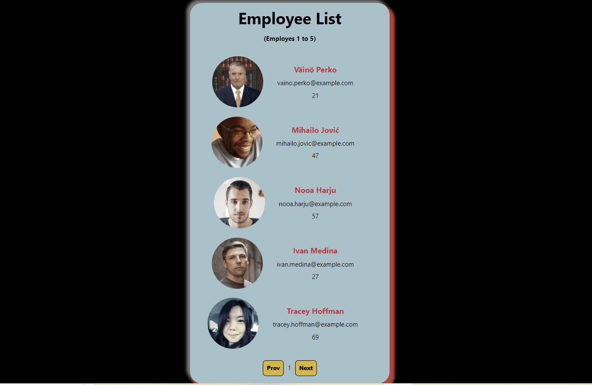

# Project : Template

## Check The Live Website ➡️ [Live Website](https://legendcx-employee-list.netlify.app/)

## Visualization of the Website



## Description

Project aims to create an image gallery app using React.

## Learning Outcomes

At the end of the project, you will be able to;

- improve coding skills within HTML & CSS & JS & ReactJS.

- use git commands (push, pull, commit, add etc.) and Github as Version Control System.

## Problem Statement

- We are adding a new project to our portfolios. So you and your colleagues have started to work on the project.

## Project Skeleton

```
Image Gellery Project(folder)
|
|----README.md
├── public
│     └── index.html
├── src
│    ├── assests
│    │       └── data.js
│    ├── components
│    │       ├── Button
│    │       │      ├── Button.css
│    │       │      ├── Button.jsx
│    │       ├── Header
│    │       │      ├── Header.css
│    │       │      ├── Header.jsx
│    │       ├── Main
│    │              ├── Main.css
│    │              ├── Main.jsx
│    │      
│    ├── App.css
│    ├── App.js
│    ├── index.css
│    ├── index.js
└── package.json
```

### Overview

I mastered HTML & CSS & JS & ReactJS features in this project.
You can see the visual representation of the website above.

## Notes

- Step 1: Create React App using `npx create-react-app image-gallery`

- Step 2: For images you can use [Images](./src/assests/data.js).

- Step 3: Push your application into your own public repo on Github

- Step 4: Add project gif to your project and README.md file.

## Resources

- 🔥 You can use [`data.js`](./src/assests/data.js) for your own work.

## Support
Open an Issue, I will check it a soon as possible 👀
Don't forget to start the repo ⭐
# <center> ⌛ Happy Coding ✍ </center>
